
<h1 style="font-family: courier;" align="center">BigFDM</h1>

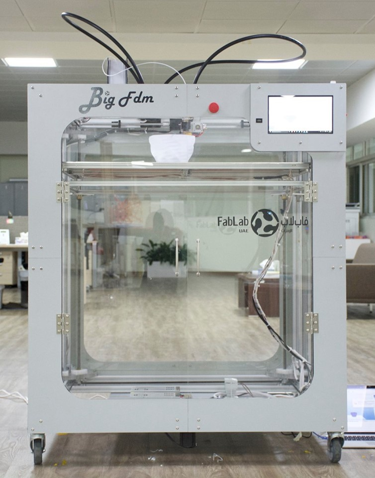

<i>Open Source Large Scale 3D Printer</i>

BigFDM
--
BigFDM is a large scale 3D printer allowing the making of big objects. Developed and built in a Fab Lab, it will allow to run classes on 3D printing and to make different experimentation useful in different scenarios, for example the printing of orthotics and prosthesis of any size, furniture, replacement parts, industrial design prototypes, molds for casting of full scale parts, artistic installations, musical instruments. Further possibilities are to print parts of other open source machines and equipment, giving to the user the freedom to prototype using large scale parts.

**BigFDM specifications**:

- **800mm x 800mm x 900mm** printing area
- **dual extruder** with interchangeble nozzle
- **2.85mm** filament
- **0.4 - 1mm** nozzle size
- **NEMA 24/23**  stepper motors
- stages with **HiWin linear guides**
- anodized **aluminium frame**
- **closed housing** of aluminum composite and acrylic
- fabbable **[satshakit](https://github.com/satshakit) and [satstep](https://github.com/satstep)** based electronics
- **integrated tablet** for machine control
- printing from **USB** drive
- BOM cost of about **2600€**
- power requirements 220V, 3000W max

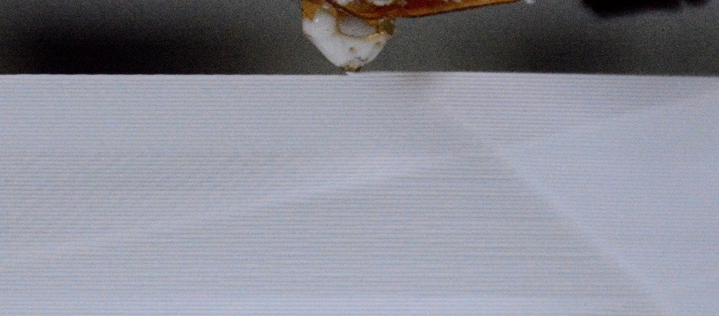

Machine design
--
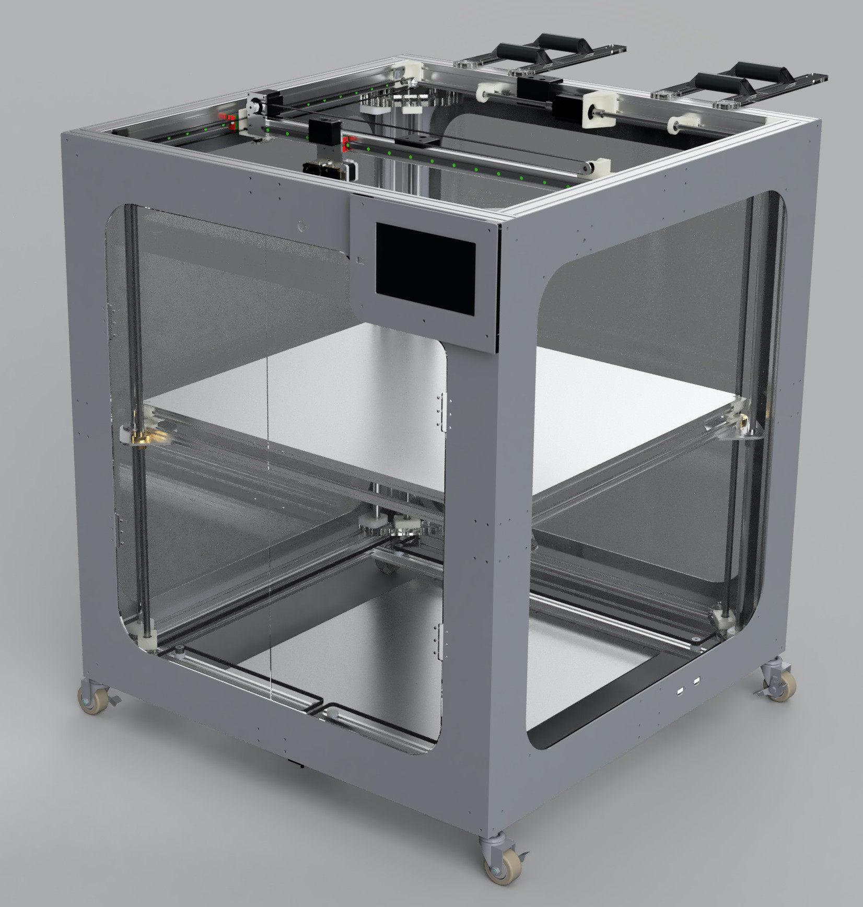

BigFDM has been designed considering to keep fixed from the beginning few constraints, which then influenced the rest of the subsequent design choices:

- the all machine parts must be inside a boxed main frame
- the machine XY stages design must be independent and consistent by itself
- the Z axis moves the bed up or down

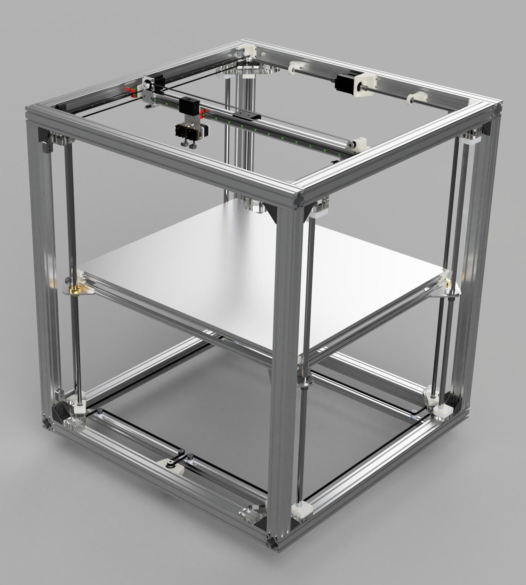

These have been tought in order to bring the following benefits:

- a **compact design** that maximize the printing area while minizing the unused space (just 2mm between the bed supports and the housing!)
-  minimizing the unused space has **lowered the cost** of the frame and the housing parts
-  the main frame serves both as **structural squared reference** for all the machine parts and well as body for the housing
-  the **XY stages can be completely removed** without disassembling any other machine section
-  the **XY stage indipendent design** can be reused to develop other machines
-  the machine printing **area can be scaled up/down** just by changing the length of few machine parts

X and Y stages
--

The X and Y stages integrates all their components inside a squared plane frame of T-Slots profiles. Implementing a sort of **stages interoperability**, the stages frame can be completely detached from the machine, and virtually, plugged into a different machine having similar frame shape (eg a laser cutter). 

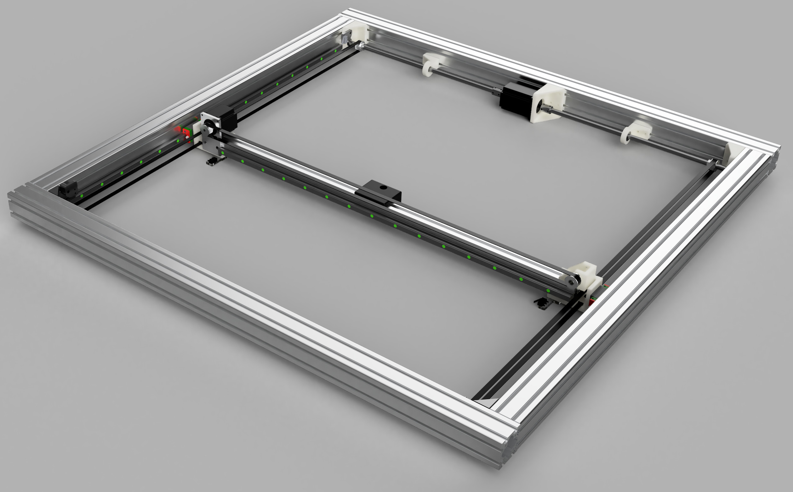

Z axis
--

The Z axis uses a single NEMA 24 to move 4 lead screws guided by linear rods and bearings. Because of layer by layer downwards needed movements, the bed will never move fast, with the maximum speed used more for manual movements. The main frame is used as support structure for all the Z axis parts.

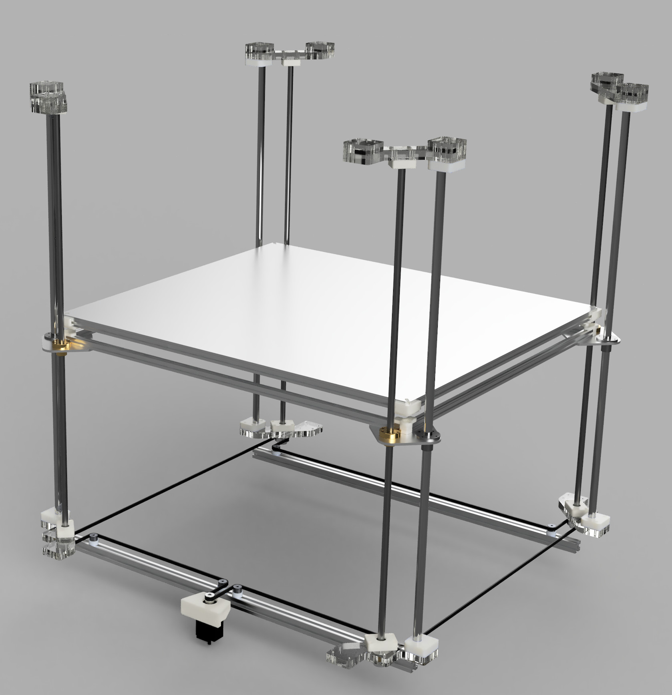

Bed
--

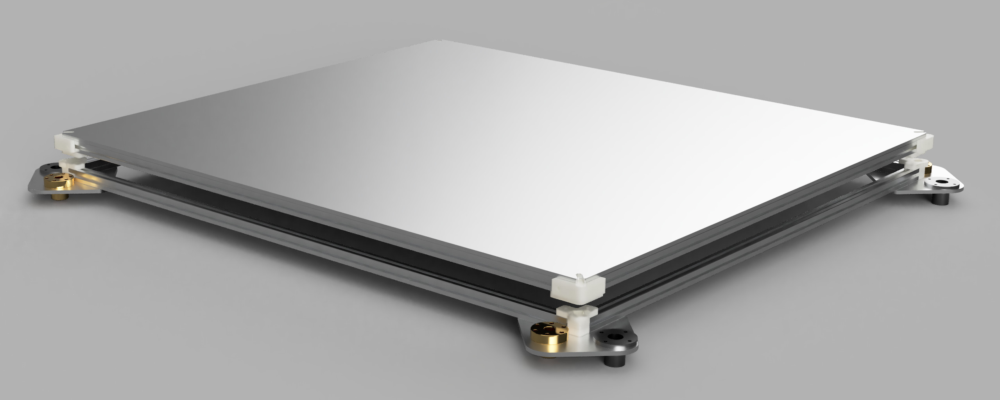

Made out of a 6mm aluminum plate cut with the CNC, the printing bed is suspended on a lower frame structure by using 4 x 8mm DIN 912 bolts. The lower bed frame in turn is attached to the Z axis lead screws and linear rods. The lower frame is kept parallel to the upper stages by mechanically aligning it during the assembly, while the printing bed flatness can be finely tuned by screwing/unscrewing the 4 bolts. The design of the printing bed takes into account its **thermal expansion**, leaving a tolerance of expansion that exceeds the calculated one from the aluminum.

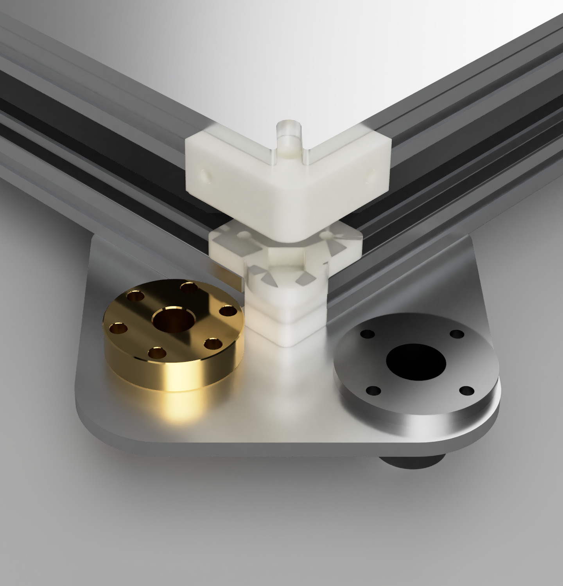

Housing
--

Electronics
--
The electronics of BigFDM consists of a set of fabbable electronics, derived from the original **[satshakit](https://github.com/satshakit)** board and **[satstep](https://github.com/satstep)** stepper drivers, plus some additional boards.
  
Following the used boards and their role in BigFDM. 

**[satshakit-mega](https://github.com/fab-machines/BigFDM/tree/master/electronics/satshakit-mega)**

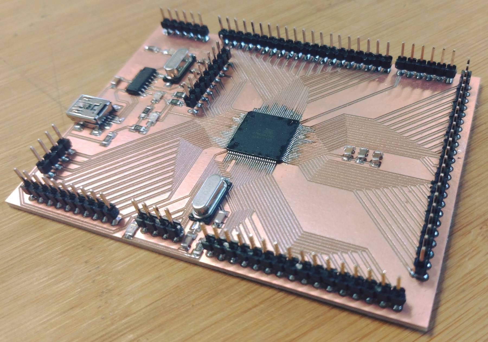

Based on the [ATMega2560](https://www.microchip.com/wwwproducts/en/ATmega2560), this board provides the necessary microcontroller hardware for the Marlin manage its logic functionalities. Furthermore integrates an USB-to-Serial converter and USB port. Developed as general purpose board, not all the pins will be used. In the future this board will be a custom made solution for BigFDM. Link to the original [repo](https://github.com/satshakit/satshakit-mega).

---------

**[satstep6600](https://github.com/fab-machines/BigFDM/tree/master/electronics/satstep6600)**

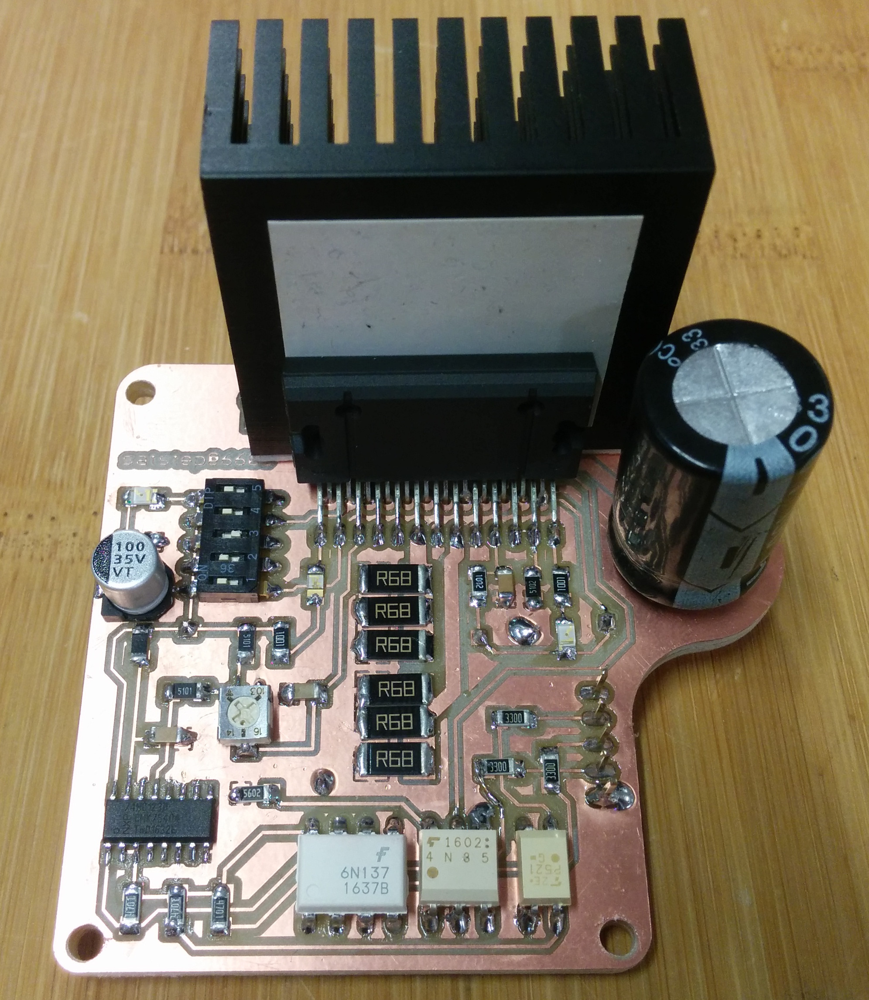

Proved to have a robust design by being used in **[LaserDuo](http://laserduo.com/)** for more than a year, the satstep6600 is the stepper driver used to move the NEMA 23/24 used in BigFDM. Based on the Toshiba [TB6600HG](http://www.massmind.org/images/massmind/TB6600HG_datasheet.pdf) it can give up to 4.5A per coil to a single motor, whereas the NEMA 24 used will take a maximum of 4A. Link to the original [repo](https://github.com/satstep/satstep6600).

---------

**[Mosftet Board](https://github.com/fab-machines/BigFDM/tree/master/electronics/mosfet-board)**

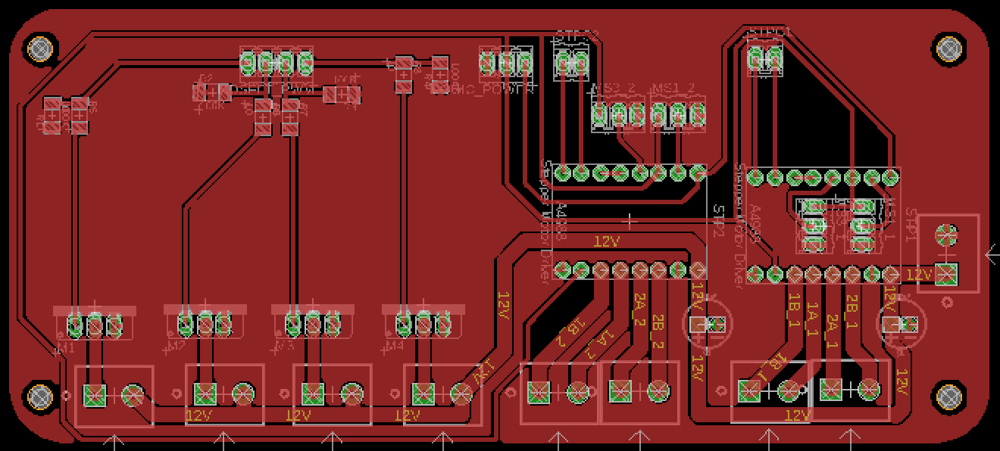

Developed as an add-in to the satshakit-mega for BigFDM, the mosfet board integrates 4 mosfets to drive the nozzle heaters and the solid stae relay for the bed heaters, plus two slots for Pololu A4988 or similar stepper drivers. The A4988 are used to drive the two nozzle stepper motors.

---------

**[Sensor Board](https://github.com/fab-machines/BigFDM/tree/master/electronics/sensor-board)**

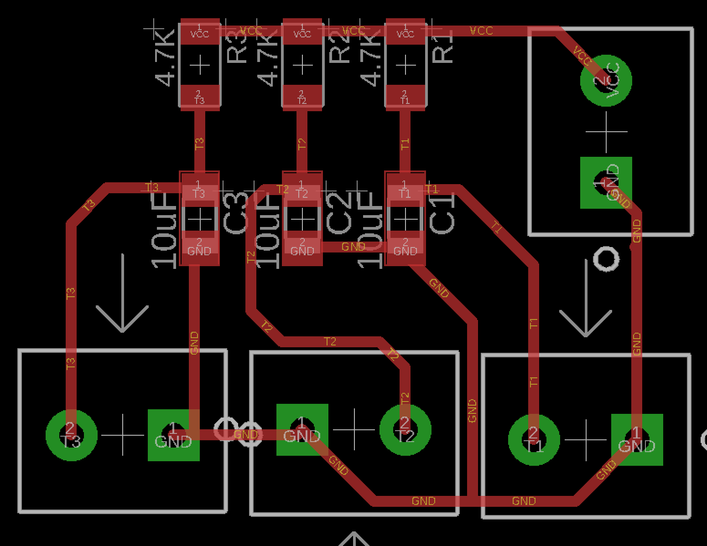

The sensor board integrates simple design with filtering capacitors and pull-up resistor. To this board the thermistors from the extruder and one of the thermistor of the bed heaters will be connected, together with the analog pins from the satshakit-mega.

---------

**[Endstop Board](https://github.com/fab-machines/BigFDM/tree/master/electronics/endstop-board)**

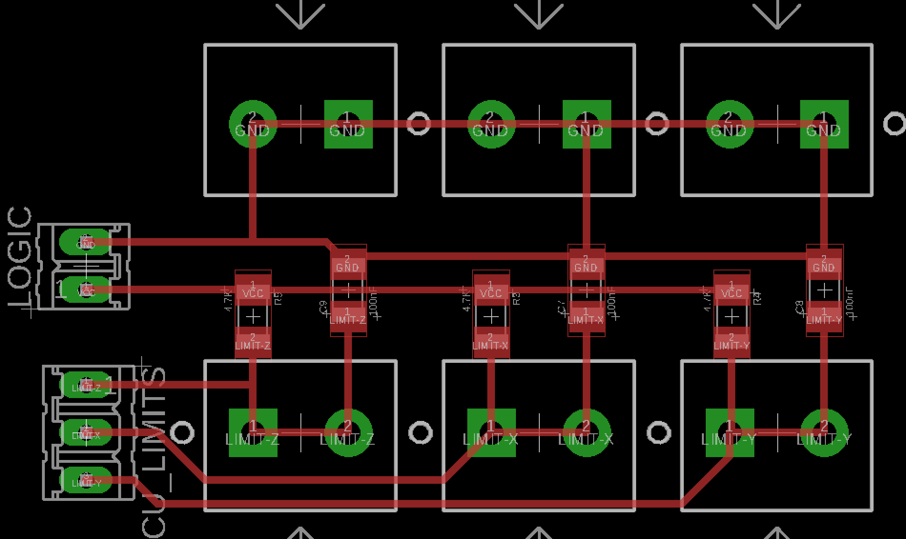

In a similar way of the Sensor Board, the Endstop Boards has some pull-up resistors and some capacitors to filter the noise coming from the endstops. To this board the endstops and the limits min (x-min, y-min, z-min) from the satshakit-mega will be connected. BigFDM uses normally open endstops. 

---------

Summary of the needed boards:

- 1 x satshakit-mega
- 3 x satstep6600
- 1 x mosfet board
- 1 x endstop board
- 1 x sensor board

To power all this electronics, and to switch on and off the heaters the following additonal parts are needed:

- 15A 24V power supply
- 25A 12V power supply
- 25A 230V solid state relay
- 3 x 24V fans (for the 3 x satstep6600)

Software
--
BigFDM uses **[Marlin firmware](https://github.com/MarlinFirmware/Marlin)** running on the satshakit-mega. The configuration changes have been applied into the configuration.h file, you can find it in the [config](https://github.com/fab-machines/BigFDM/tree/master/config) folder of this repository.

To control the machine and to stream the G-Code, [Repetier-Host](https://www.repetier.com/) has been used.

Build your own BigFDM
--

BigFDM is made by using a mix of fabricated and ready-made parts. The ready-made parts are selected to be as common/standard as possible, to make the sourcing of them easy in many countries. For both the raw materials needed for the fabricated parts, and the ready-made parts, refer to the Bill-of-Material for details: **[BigFDM BOM](https://github.com/fab-machines/BigFDM/raw/master/docs/BigFDM%20BOM.pdf)**

The fabrication of the parts mainly relays on standard [Fab Lab equipment](https://docs.google.com/spreadsheets/d/1U-jcBWOJEjBT5A0N84IUubtcHKMEMtndQPLCkZCkVsU/pub?single=true&gid=0&output=html). It will be therefore possible to make BigFDM in any of Fab Labs worldwide having it. Below a list of the required tools and machines:

- C02 laser cutter:
 - able to cut 8mm acrylic
 - needed for small acrylic parts
- large format wood CNC machine:
 - ShopBot or similar, size 2500x1250mm
 - to machine the aluminum parts (bed, Z axis supports)
 - to machine the aluminum composite for the housing
 - to machine the acrylic for the housing windows
 - to machine the POM parts (motor holders, attachments)
- 3D printer:
 - a small one (20x20x20cm) is sufficient
 - to print the filament/cables holders 
- Desktop format CNC machine:
 - Roland MDX50/MDX20/SRM20 or similar small machine (as well the cheap chinese ones)
 - to produce the required PCBs
- standard set of tools:
 - spanner key set
 - hex key set
 - DIN 875
 - calipers
 - rulers
 - screwdriver set
 - player set (grabber/cutter etc..)
 - clamps
 - rubber hummers

Both fabricated and ready-made parts have been modeled inside the **[BigFDM Fusion 360 model](https://github.com/fab-machines/BigFDM/raw/master/cad/BigFDM.f3d)**. Using Fusion is possible to export/prepare the parts for production in the following ways:

- right click save as STL, on a body that needs to be 3D printed
- use the built-in Fusion CAM processor for the machined parts
- project on a surface, and then right click export as DXF, for laser cutting
 
For more details about the tools and once you have all the fabricated and ready-made parts parts available, refer to the for step-by-step assembly instructions and tips: **[BigFDM Building Manual](https://github.com/fab-machines/BigFDM/wiki)** 

Big FDM requires different fabbable PCBs to work. Below the download links for the eagle files that you use to fabricate them:

- **[satshakit-mega schematic](https://github.com/fab-machines/BigFDM/blob/master/electronics/satshakit-mega/satshakit-mega.sch)**, **[satshakit-mega board](https://github.com/fab-machines/BigFDM/blob/master/electronics/satshakit-mega/satshakit-mega.brd)**
- **[satstep6600 schematic](https://github.com/fab-machines/BigFDM/raw/master/electronics/satstep6600/satstep6600.sch)**, **[satstep6600 board](https://github.com/fab-machines/BigFDM/raw/master/electronics/satstep6600/satstep6600.brd)**
- **[mosfet board schematic](https://github.com/fab-machines/BigFDM/raw/master/electronics/mosfet-board/mosfer-board.sch)**, **[mosfet board](https://github.com/fab-machines/BigFDM/raw/master/electronics/mosfet-board/mosfet-board.brd)**
- **[sensor board schematic](https://github.com/fab-machines/BigFDM/raw/master/electronics/sensor-board/sensor-board.sch)**, **[sensor board](https://github.com/fab-machines/BigFDM/raw/master/electronics/sensor-board/sensor-board.brd)**
- **[endstop board schematic](https://github.com/fab-machines/BigFDM/raw/master/electronics/endstop-board/endstop-board.sch)**, **[endstop board](https://github.com/fab-machines/BigFDM/raw/master/electronics/endstop-board/endstop-board.brd)**

Download here the configuration files (right click save as):

- **[Marlin BigFDM](https://github.com/fab-machines/BigFDM/raw/master/config/Marlin-1.1.x-BIGFDM.zip)** 
- **[Cura profile settings for 1mm nozzle](https://github.com/fab-machines/BigFDM/raw/master/config/Cura_BigFDM.curaprofile)** 
- **[Cura  machine settings](https://github.com/fab-machines/BigFDM/raw/master/config/BigFDM_machine_settings.png)**
- **[Cura extruder settings](https://github.com/fab-machines/BigFDM/raw/master/config/BigFDM_extruder_settings.png)**

Known issues
--

- the extruder used is a dual Geetech MK8, which is good up to 0.5mm nozzle but has difficulties in keeping the temperature with an 1mm nozzle; in the future will be replaced by a custom made extruder supporting nozzles up to 2mm

- because of the difficulties for the extruder to warmup, to save time it is recommended to start heating it manually whenever possible before starting printing 

- the electronics setup requires improvements, especially a custom made board in place of the satshakit-mega and an additonal all-in-one board, replacing the mosfet, sensor and endstop boards

- the Z axis design needs multiple parts for the supporting corners of the lead screws and the linear rods; in the future replaced by an unique block of CNC milled aluminum
 

Media
--
**BigFDM videos**:

**BigFDM pictures**:

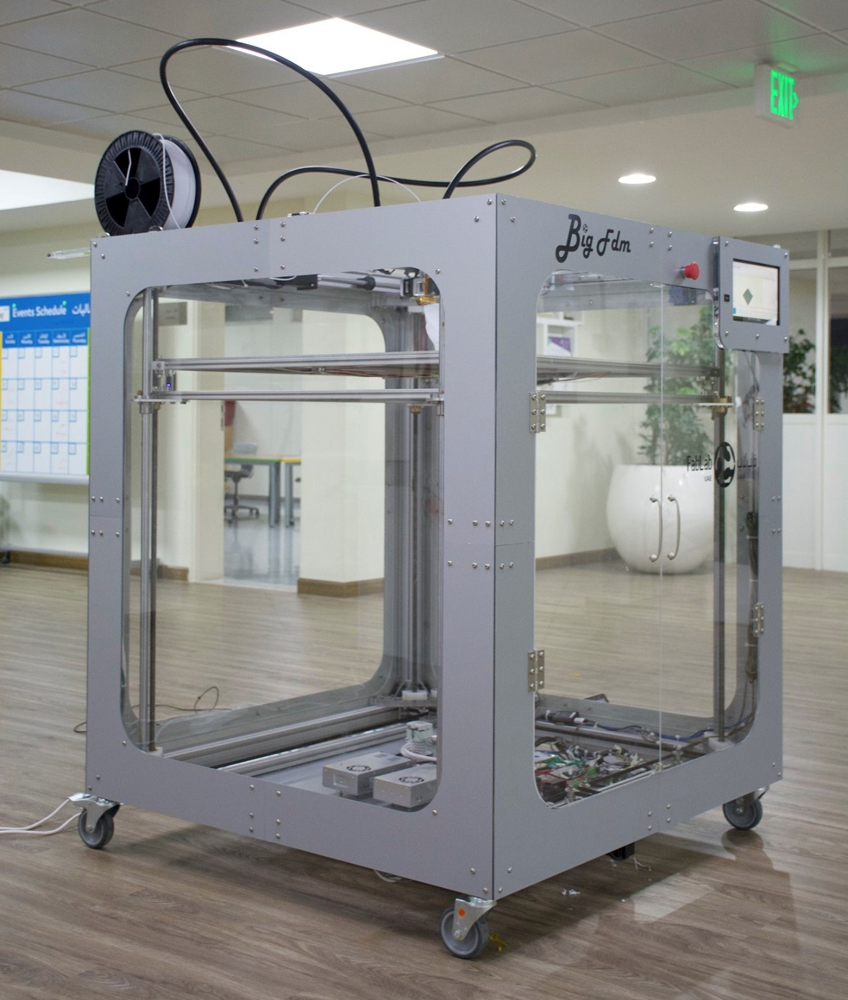
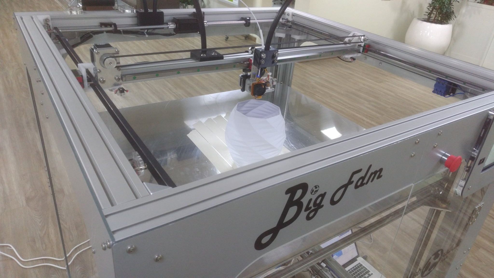

Author
--

**[Daniele Ingrassia](http://www.fabacademy.org/archives/2015/eu/students/ingrassia.daniele/index.html)**

**Project Helper:** 
**[Hashim Al Sakkaf](http://archive.fabacademy.org/fabacademy2017/fablabuae/students/154/)**

Contact
--
- **ingrassiada@gmail.com**
- **[linkedin](http://it.linkedin.com/in/danieleingrassia)**

Acknowledgements
--

The development of this machine has been funded by: 
**[German Federal Ministry of Education and Research](https://www.bmbf.de/en/index.html)**

Funds implemented by: 
**[OpenLab Hamburg](http://openlab-hamburg.de/startpage/)** 
[Helmut-Schmidt-Universität Universität der Bundeswehr](https://www.hsu-hh.de/en/) 
Laboratorium Fertigungstechnik 
Holstenhofweg 85 
22043 Hamburg 

Thanks: 
**[Fablab UAE](http://fablabuae.ae/)** 
176 6 D St - Satwa  
Dubai - United Arab Emirates 
fablabuae@gmail.com

License
-- 
BigFDM is licensed under the terms of the open source license: Creative Commons Attribution-ShareAlike 4.0 International ([CC BY-SA 4.0](https://creativecommons.org/licenses/by-sa/4.0/)).

Note
--

This documentation will be continuously improved as soon there are updates and/or improvements on the machine.

Disclaimer  
--

This hardware/software is provided "as is", and you use the hardware/software at your own risk. Under no circumstances shall any author be liable for direct, indirect, special, incidental, or consequential damages resulting from the use, misuse, or inability to use this hardware/software, even if the authors have been advised of the possibility of such damages.

